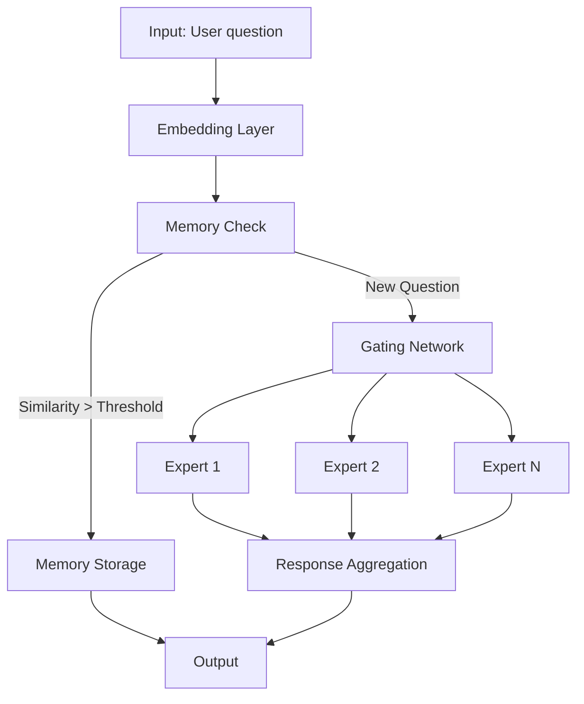

# `moe-model` API Documentation

This is a Dockerized API that provides a **Mixture of Experts (MoE)** system for **Question Answering** using a **Neuro-Symbolic AI** approach.
A user can only make 10 requests to control usage.

---

## Run the API with Docker

### 1. Prerequisites

Ensure Docker is installed on your machine.

### 2. Pull the Docker image

```bash
docker pull blueride0/fastapi-moe:1.0.0
```

### 3. Run the container

```bash
docker run -d -p 8000:8000 blueride0/fastapi-moe:1.0.0
```

### 4. Access the API

- Swagger UI:
```bash
http://localhost:8000/docs
```

### 5. View container logs

 ```bash
 docker logs <container_id>
```

## MoE-QR Model Architecture



### Tech Stack

- Python 3.10+
- PyTorch (Machine Learning backend)
- Sentence-Transformers (Semantic similarity)
- scikit-learn (Cosine similarity computation)

### Key Features

1. Continual Learning

- Input Format:

  ```json
  [
  {"question": "What is the capital of France?", "reponse": "Paris"},
  {"question": "What is the square root of 16?", "reponse": "4"}
  ]
  ```
  
- Incremental ingestion of new Q/A pairs
- Update experts without full retraining

### 2. Intelligent Inference

- Semantic similarity recognition (e.g., "Hello" ≈ "Bonjour")
- Dynamic routing to the most relevant experts
- Configurable similarity threshold (default: 0.7)

### 3. Memory Management

- Stores and indexes question embeddings
- Instant answers for known questions
- Built-in deduplication mechanism

---

### 📝 License

This project is released under the MIT License.